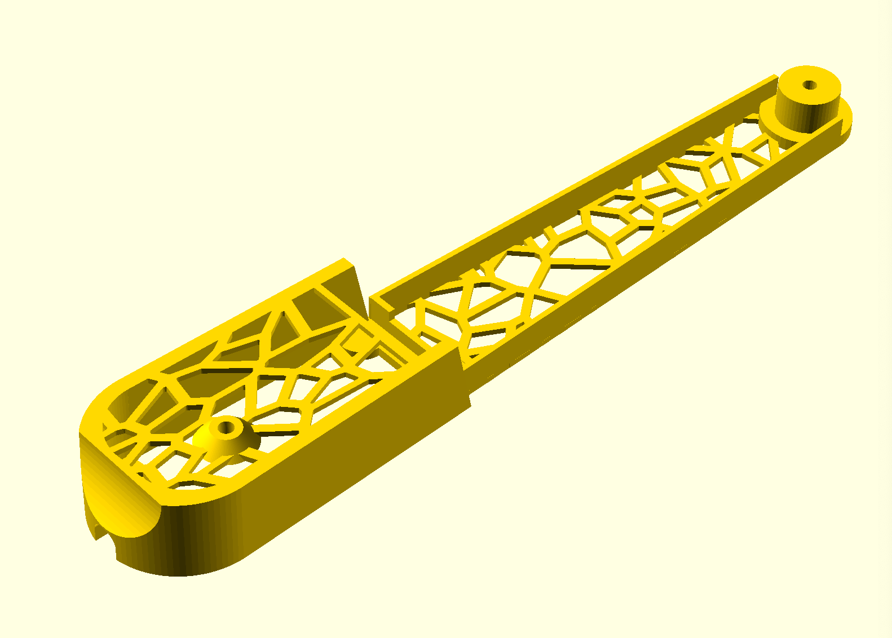
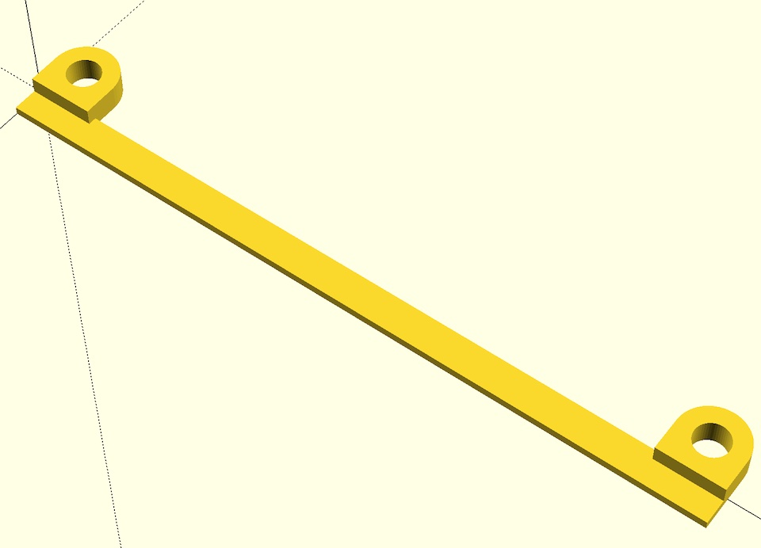

# openscad-vodafone-smart-router-base

This is a replacement part for the Vodafone Smart Router (of Sagem manufacture) used by Vodafone Portugal and other operations in Europe.

This device has a built-in ONT, 4 Gigabit Ethernet ports, internal Wi-Fi, voice, USB 2.0 and coax, but also has a particularly poorly thought out base that prevents you from mounting it flush against a wall or placing it horizontally, so I designed this to replace the round "foot".

I recommend adding a little clearance (~2mm or so) to this by sticking on some adhesive rubber feet (there are a few plates for that purpose), so that there is enough airflow to cool the device by convection.

Also, if you happen to have any red PETG (Pantone 485, of course), I would recommend using that as well.

Printing suitable wall mount clips is left as an exercise to the reader (or a later revision).

## Bonus

Since I'm mounting this flush to the wall of a utility closet (that I can drill into), I also designed a very simple, slim brace that slots into the top groove--this is enough for the router not to topple outward, although your mileage may vary:

## Licensing

This uses Voronoi tessellation scripts by Felipe Sanches <juca@members.fsf.org>, which are GPLv3 and bundled for convenience.

My own files are MIT licensed.
